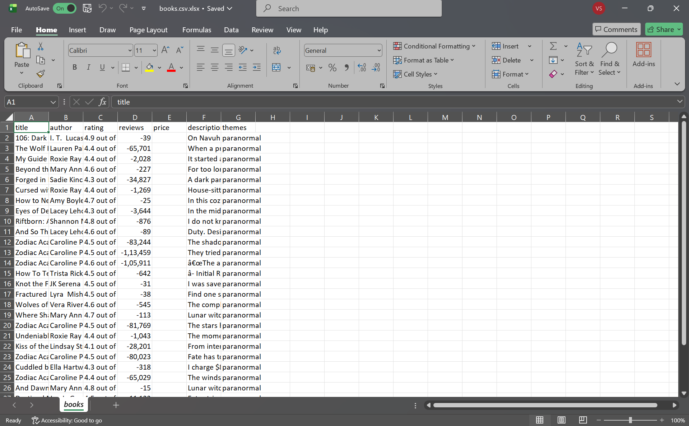

# Amazon Book Extractor

A modular Python-based web scraping project that extracts book data from Amazon, processes it using pandas, and stores it in a structured format.

---

## Overview

This project is designed to demonstrate practical skills in web scraping, data processing, and modular software design. It extracts relevant information such as book titles, prices, and ratings, and organizes the data for further analysis.

---

## Features

* Web scraping using BeautifulSoup
* Data extraction from structured HTML
* Data cleaning and processing using pandas
* Modular architecture with separation of concerns
* Automated data storage in CSV format
* Scalable structure for adding more scrapers

---

## Tech Stack

* Python
* Requests
* BeautifulSoup (bs4)
* Pandas
* lxml (HTML parser)
* tqdm (progress tracking)

---

## How to Run

### 1. Clone the repository

```
git clone https://github.com/vartik1212/amazon-book-extractor.git
```

### 2. Navigate to the project directory

```
cd amazon-book-extractor
```

### 3. Install dependencies

```
pip install -r requirements.txt
```

### 4. Run the application

```
python main.py
```

---

## Output

* Extracted data is stored in the `data/` directory
* Output format: CSV

## Sample Output



---

## Notes

* The project uses HTTP requests and HTML parsing to extract data.
* Amazon may restrict or block scraping requests; in such cases, delays or headers may be required.
* The structure allows easy extension for multi-page scraping and additional data fields.

---

## Future Improvements

* Multi-page scraping support
* Integration with a database (MongoDB / PostgreSQL)
* REST API using Flask or FastAPI
* Data visualization dashboard
* Error handling and logging improvements

---

## Author

Vartik
